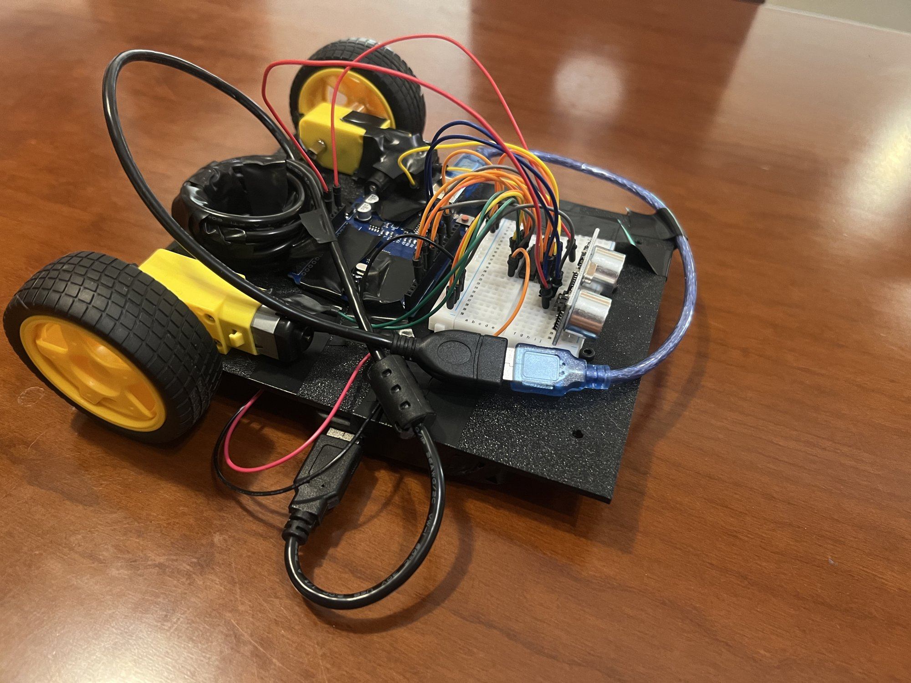

# Smart Vision Robot

An autonomous differential-drive robot built from scratch: 3D-printed chassis, Arduino → STM32 firmware in C, and (soon) a Raspberry Pi 5 + OpenCV vision layer. Two brains: the STM32 handles real-time reflexes, the Pi will handle seeing and thinking, talking over UART.

**Latest milestone — autonomous obstacle avoidance:** [demo video](docs/media/obstacle-avoidance.mp4)

## Progress

- [x] Chassis designed in Fusion 360, printed in PETG (v3 — see `docs/design-notes.md`)
- [x] Drive base assembled: TT gear motors + L293D H-bridge + ball caster
- [x] Untethered driving — square-drive test (Arduino) — [video](docs/media/square-drive.mp4)
- [x] Ultrasonic obstacle avoidance — fully autonomous (Arduino)
- [ ] Motor control ported to STM32 (HAL, hardware-timer PWM)
- [ ] Ultrasonic via timer input capture on STM32 (non-blocking)
- [ ] Full autonomy on STM32
- [ ] MPU-6050 IMU over I2C
- [ ] Raspberry Pi 5 + Camera Module 3: OpenCV color tracking → UART commands

## Hardware

Arduino Uno (prototype brain) · STM32 Nucleo (final real-time brain) · L293D H-bridge · 2× TT DC gear motors · HC-SR04 ultrasonic · MPU-6050 IMU · Raspberry Pi 5 4GB + Camera Module 3 · 4×AA motor supply + USB power bank · custom PETG chassis (Bambu Lab P1S)

## Why rebuild on the STM32?

The Arduino version reads the sensor with `pulseIn()`, which blocks the CPU while waiting for the echo. The STM32 rebuild measures the echo with a hardware timer in input-capture mode and generates PWM from hardware timers — non-blocking and precise, the way production embedded systems work. That rebuild is the point of the project.

## Repo map

- `firmware/arduino/` — Week 1 prototype sketches
- `firmware/stm32/` — Week 2 HAL port
- `cad/` — chassis STLs (v1–v3, see `docs/design-notes.md` for the design history)
- `docs/wiring/` — wiring photos + `connections.md`
- `docs/media/` — milestone videos and photos

## Build log

| Day | Milestone | Video |
|---|---|---|
| 5 | First untethered drive — square pattern on Arduino | [watch](docs/media/square-drive.mp4) |
| 6 | Autonomous obstacle avoidance on Arduino | [watch](docs/media/obstacle-avoidance.mp4) |

---

Built by [Bagelis Bliziotis](https://github.com/BagelisBliziotis) — ECE student at NTUA (ΣΗΜΜΥ), working toward embedded systems and robotics.
